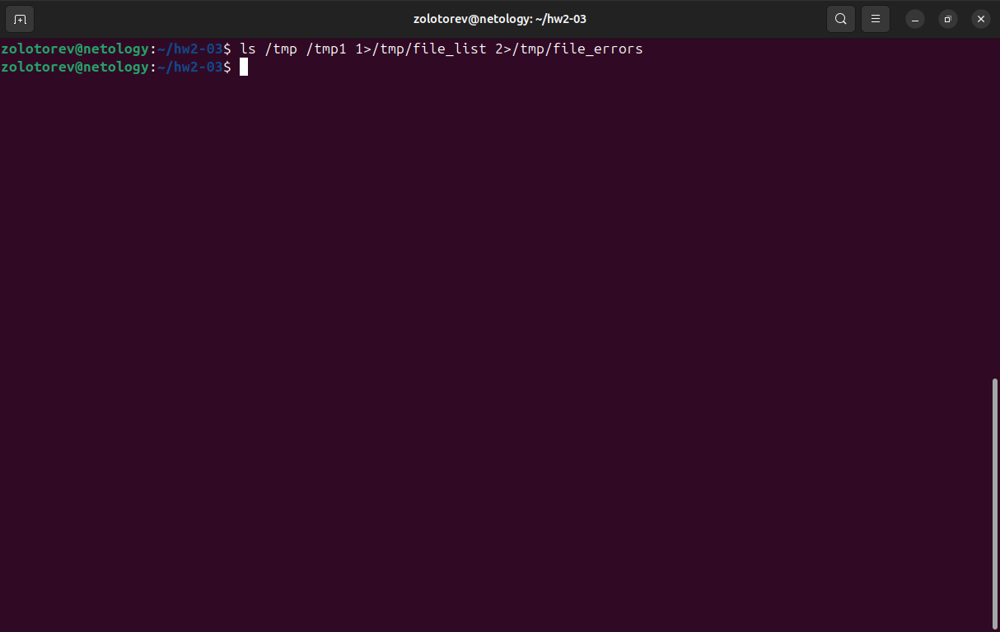
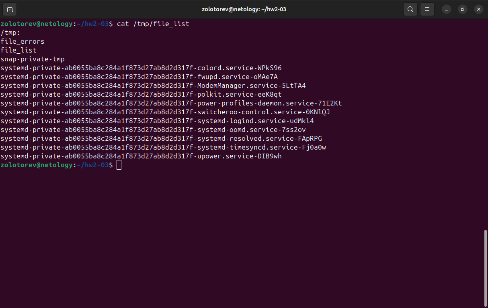
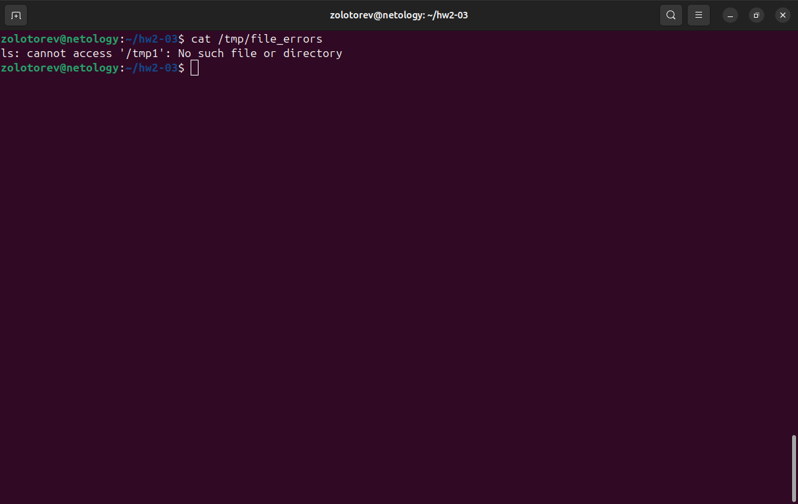
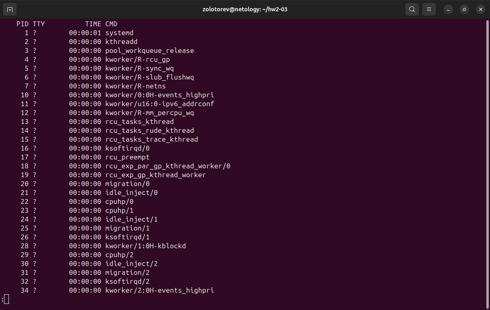
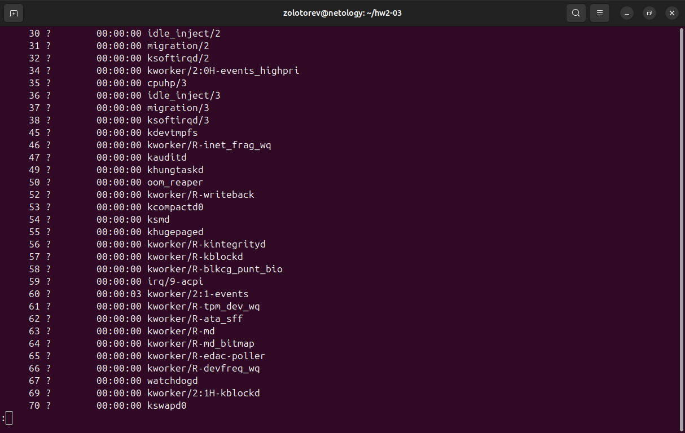
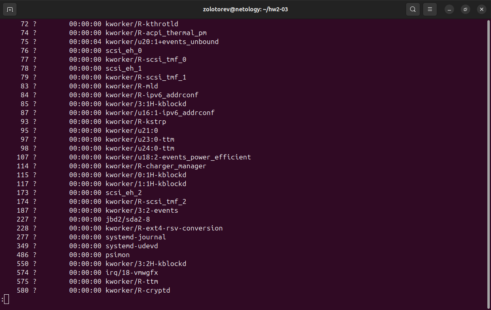
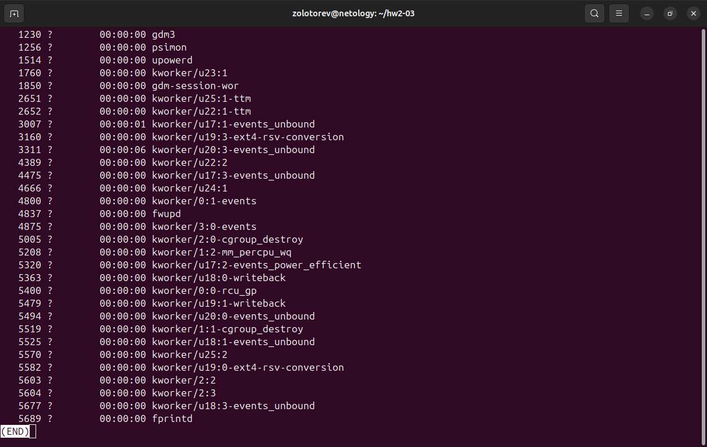
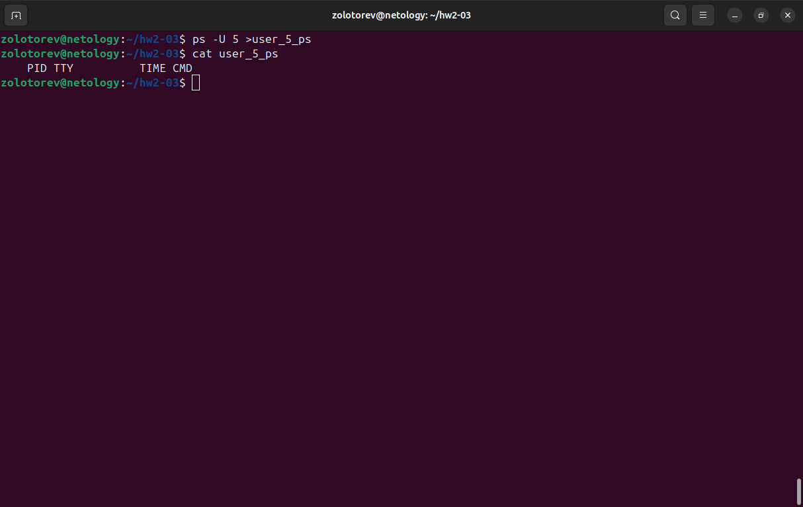

# Домашнее задание к занятию "Процессы, управление процессами "
### Золоторев Н.Д.

### Задание 1
Измените команду ls /tmp /tmp1так, чтобы:

    Результат работы (список файлов) для текущего запуска команды выводился в файл /tmp/file_list.
    Ошибки для каждого запуска добавлялись в файл /tmp/file_errors.

Примечание к заданию:

    Создавать /tmp1 не требуется. Директория должна отсутствовать для генерации вывода stderr.
    Задание необходимо выполнить одной командой.

В качестве решения пришлите полученную команду и скриншот терминала с выводом содержимого созданных файлов

### Решение 1

ls /tmp /tmp1 1>/tmp/file_list 2>/tmp/file_errors

cat /tmp/file_list

cat /tmp/file_errors

### Задание 2

Напишите команду, которая выводит все запущенные процессы пользователя root в файл "user_root_ps".

### Решение 2

ps -U root 1>user_root_ps

### Задание 3

Начинающий администратор захотел вывести все запущенные процессы пользователя с логином "2" в файл "user_2_ps".

Для этого он набрал команду:

ps -U 2> user_2_ps

Затем, он аналогично повторил для пользователя с логином "5" вывод в файл "user_5_ps":

ps -U 5> user_5_ps

Вопрос:

Почему вывод этих команд и содержимое файлов сильно отличаются друг от друга? Как должны выглядеть правильные команды?

Примечание:

Если у вас в системе нет пользователей "2" и/или "5" (это нормальная ситуация), то утилита ps выводит только одну строку:

 PID TTY          TIME CMD

Ответ приведите в виде снимка экрана с комментариями в свободной форме.

### Решение 3

Вывод этих команд и содержимое файлов отличаются друг от друга, так как нет пробела между 2> и 5>. При выполнении команды ps -U 2> user_2_ps, начинающий администратор вывел в файл не запущенные процессы пользователя, а ошибку, которая появляется после ввода команды ps –U без указания пользователя.  

Правильные команды, для вывода всех запущенных процессов пользователя, должны выглядеть так (между 2> и 5> должны быть пробелы):

ps -U 2 >user_2_ps

ps -U 5 >user_5_ps

