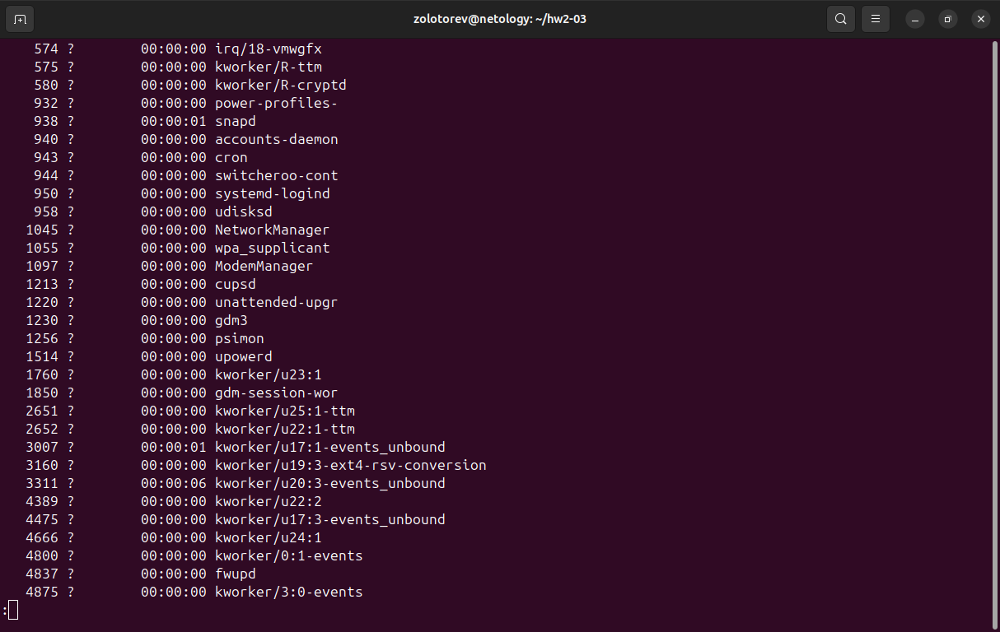

# Домашнее задание к занятию "Процессы, управление процессами "
### Золоторев Н.Д.

### Задание 1
Измените команду ls /tmp /tmp1так, чтобы:

    Результат работы (список файлов) для текущего запуска команды выводился в файл /tmp/file_list.
    Ошибки для каждого запуска добавлялись в файл /tmp/file_errors.

Примечание к заданию:

    Создавать /tmp1 не требуется. Директория должна отсутствовать для генерации вывода stderr.
    Задание необходимо выполнить одной командой.

В качестве решения пришлите полученную команду и скриншот терминала с выводом содержимого созданных файлов

### Решение 1

ls /tmp /tmp1 1>/tmp/file_list 2>/tmp/file_errors

cat /tmp/file_list

cat /tmp/file_errors

### Задание 2

Напишите команду, которая выводит все запущенные процессы пользователя root в файл "user_root_ps".

### Решение 2

ps -U root 1>user_root_ps

### Задание 3
### Решение 3
